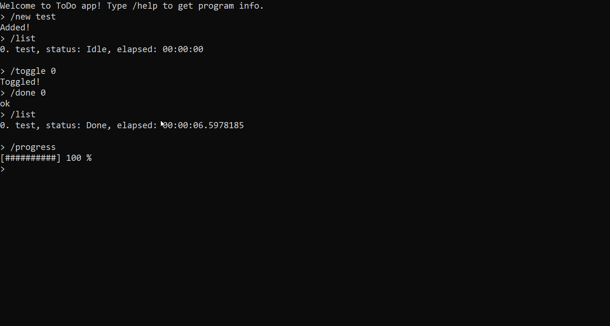

# ToDo app

A simple console ToDo app

## Usage

```
/list  - List tasks
/new name - New task
/remove index - Remove task
/idle index - Mark task idle
/done index - Mark task done
/toggle index - Toggle task (idle/doing)
/progress  - See your progress
/help  - List available commands
/save filename - Save tasks to file
/load filename - Load tasks from file
```

## Screenshots

